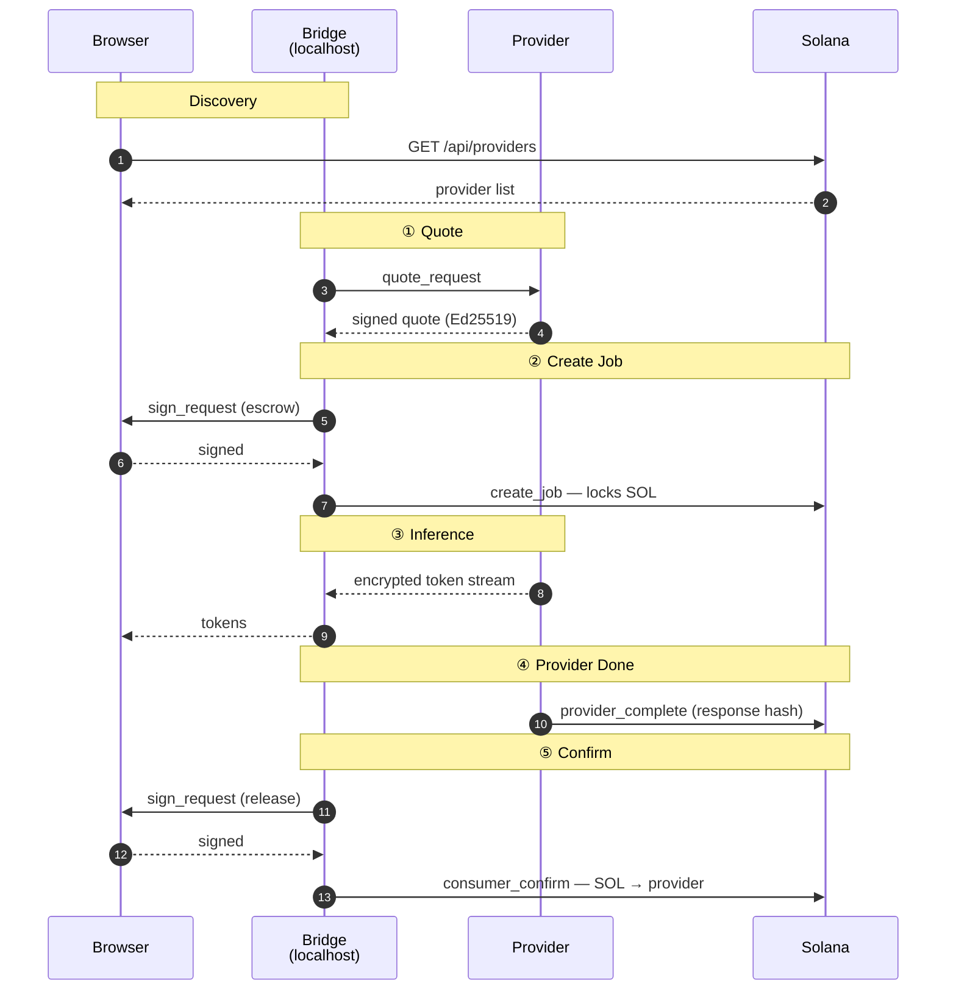

<p align="center">
  
</p>

<h1 align="center">QVAC Marketplace</h1>

<p align="center">
  <b>Decentralized peer-to-peer AI inference, paid in SOL.</b><br/>
  Run open-source LLMs on a stranger's machine — encrypted end-to-end, no API key, no logs, no middleman.<br/>
  Settlement is enforced by a Solana smart contract: you pay only when the provider delivers.
</p>

<p align="center">
  <a href="https://www.qvacmarketplace.io">
    
  </a>
  <a href="https://explorer.solana.com/address/6rbgdrQdxziVC25kt1Xmtz36ApiLdUVGpdyDcssmgoec?cluster=devnet">
    
  </a>
  
  
  
  
  
</p>

---

## 💡 Why QVAC?

- 🔐 **No accounts, no API keys.** Pay per request directly from your wallet.
- 👁️ **Truly private.** Prompts and responses travel peer-to-peer over Holepunch HyperDHT with end-to-end Noise encryption — neither the marketplace nor Solana ever see the content.
- ⚖️ **Trustless settlement.** Funds sit in an on-chain escrow until the provider commits a verifiable response hash. Mismatched delivery → consumer refund.
- 🌐 **Open marketplace.** Anyone with a CPU or GPU can register a provider, set their own price, and earn SOL by serving open-source models (Qwen, Llama, Mistral, …).

---

## 🏗️ How it works



Five phases per inference. Two of them require a Phantom signature; the rest happen automatically.

| # | Phase | What happens | Who signs |
|---|---|---|---|
| ① | **Quote**          | Browser asks the provider's quote channel for a price | — |
| ② | **Create Job**     | Bridge builds tx, consumer signs in Phantom, escrow opens on-chain | **Consumer** (Phantom) |
| ③ | **Inference**      | Tokens stream P2P over Hyperswarm, end-to-end encrypted | — |
| ④ | **Provider Done**  | Provider commits SHA-256 of the response on-chain | **Provider** (auto) |
| ⑤ | **Confirm**        | Consumer signs again to release escrow → SOL lands in provider wallet | **Consumer** (Phantom) |

### 💸 How payment works

Each inference costs the provider's quoted price — paid in SOL through an on-chain escrow so neither party has to trust the other:

1. **Lock.** At `create_job`, the quoted price moves from the consumer's wallet into a Job account on Solana. The provider cannot touch it yet.
2. **Earn.** After streaming the response, the provider commits a hash of the output on-chain in `provider_complete`.
3. **Release.** Phantom prompts the consumer once more. `consumer_confirm` moves the locked SOL from the Job account directly to the provider's wallet and closes the Job account (rent returns to the consumer).

The two Phantom prompts are **not two separate charges** — it's the same SOL flowing in two steps (wallet → escrow → provider). Total per request = provider's quoted price + two small Solana network fees.

If the provider never delivers, the consumer can call `refund_job` after `JOB_TIMEOUT` (600 s) and reclaim the escrowed funds.

---

## 📁 Repository structure

```
qvac-marketplace/
├── programs/        Anchor smart contract — 7 instructions      (Rust)
├── clients/         Codama-generated TypeScript SDK             (TS)
├── tests/           Integration tests — 39 passing              (TS)
├── qvac-bridge/     Local WebSocket bridge for the consumer     (Node)
└── qvac-provider/   Inference node — register, serve, earn      (Node)
```

| Component | Purpose | Docs |
|---|---|---|
| **Anchor program**     | On-chain registry + escrow + settlement | [`programs/README.md`](programs/README.md) |
| **TypeScript client**  | Codama-generated SDK consumed by bridge + provider + webserver | [`clients/README.md`](clients/README.md) |
| **Bridge**             | Local daemon: WebSocket on `localhost:3000` ↔ Solana ↔ Holepunch | [`qvac-bridge/README.md`](qvac-bridge/README.md) |
| **Provider**           | Long-running inference node — DHT-announces, signs quotes, earns SOL | [`qvac-provider/README.md`](qvac-provider/README.md) |
| **Webserver** *(separate repo)* | Hosts the marketplace UI at `qvacmarketplace.io`; read-only API | [`qvac-webserver/README.md`](https://github.com/qvacmarketplace/qvac-webserver) |

---

## 🚀 Quick start

### As a consumer — use the marketplace

A polished walkthrough lives at **[qvacmarketplace.io/docs/consumer](https://www.qvacmarketplace.io/docs/consumer)** (plain-language, includes screenshots). The technical short version:

1. Install [Phantom](https://phantom.app) and switch it to **devnet**.
2. Open [www.qvacmarketplace.io](https://www.qvacmarketplace.io).
3. Run the bridge on your machine: `cd qvac-bridge && npm install && npm start`.
4. Click **Connect Phantom**, **Airdrop 1 SOL** (free devnet faucet), pick a **LIVE** provider from the sidebar, and start chatting.
5. Phantom asks you to approve two transactions per inference — see [How payment works](#-how-payment-works).

→ Full guide: [`qvac-bridge/README.md`](qvac-bridge/README.md)

### As a provider — earn SOL

1. Clone this repo, `cd qvac-provider/`.
2. Generate a keypair, fund it on devnet, generate a stable DHT seed (one-liner in the provider README).
3. `npm install && npm start` — the node auto-registers on Solana and appears in the marketplace within ~30 seconds.
4. You earn SOL for every inference request you serve. No KYC, no platform cut.

→ Full guide: [`qvac-provider/README.md`](qvac-provider/README.md)

---

## 🛠️ Development

### Prerequisites

| Tool | Version |
|---|---|
| Node.js | ≥ **22.17** (QVAC SDK fails silently on older versions) |
| Rust + Anchor | **0.30.1** |
| Solana CLI | latest |
| pnpm | latest |

### Run all components locally

```bash
git clone https://github.com/qvacmarketplace/qvac-marketplace
cd qvac-marketplace
pnpm install

# Terminal 1 — provider node
cd qvac-provider && npm start

# Terminal 2 — local bridge
cd qvac-bridge && npm start
```

Then open `qvacmarketplace.io` (or `localhost:3001` if running the webserver locally).

### Run the test suite

```bash
anchor test
```

39 integration tests against a local validator. Full settlement loop verified end-to-end on every run.

### Regenerate the TypeScript client

```bash
anchor build      # writes target/idl/qvac_marketplace.json
npx codama        # rewrites clients/js/src/generated/
```

→ Full client docs: [`clients/README.md`](clients/README.md)

---

## 📋 Program instructions

The on-chain program exposes 7 instructions:

| Instruction          | Description |
|---|---|
| `register_provider`  | Create a Provider PDA (one per authority wallet) |
| `update_provider`    | Update a provider's name and supported task types |
| `rotate_peer_id`     | Update the on-chain DHT peer ID after a seed rotation |
| `create_job`         | Verify the provider's signed quote and escrow SOL |
| `provider_complete`  | Provider commits the response hash; transitions Job → ProviderDone |
| `consumer_confirm`   | Release escrow to the provider; close the Job |
| `refund_job`         | Reclaim escrow if the provider never delivered (after timeout) |

Full details — account layouts, the quote signature design, error codes — in [`programs/README.md`](programs/README.md).

---

## 🛡️ Architecture notes

- **Privacy.** Inference traffic runs over Holepunch HyperDHT with Noise protocol encryption. The webserver and Solana only see public keys and 32-byte hashes — never message content.
- **Trust model.** The provider commits a SHA-256 response hash on-chain in `provider_complete` before the consumer releases escrow. Mismatched delivery is detectable off-chain; in MVP the consumer's recourse is `refund_job` (only available before `provider_complete`). A formal dispute path is reserved for V2.
- **Bridge.** Listens on `127.0.0.1:3000` only, with an explicit Origin allow-list — no other website (and no machine on your LAN) can talk to it. Your private key stays in Phantom.
- **Phantom.** Two approvals per inference — both transactions are built locally by the bridge and signed in-wallet. The bridge never holds your private key.

---

## ❓ FAQ

<details>
<summary><b>Is the inference itself trustless?</b></summary>

No — the consumer trusts the provider to actually run the model and stream the right tokens. The on-chain part is the *payment* mechanism: funds are locked in escrow until the provider commits a response hash. A bad provider can earn the fee without serving real content (the consumer's recourse in MVP is to not select that provider again — reputation lives on-chain via `jobs_completed`).

</details>

<details>
<summary><b>Why two transactions per request instead of one?</b></summary>

Because the consumer can't sign at the moment inference completes — they're in the browser, not running a server. The escrow pattern lets the consumer pre-authorize spending up to `amount`, the provider proves delivery on-chain, and the consumer releases.

</details>

<details>
<summary><b>Why Holepunch and not WebRTC or libp2p?</b></summary>

Holepunch HyperDHT punches NAT cleanly, gives free Noise-based encryption, and the QVAC SDK already uses it for inference streaming. Reusing the same transport for the quote channel keeps the design coherent.

</details>

<details>
<summary><b>Why devnet only?</b></summary>

This is an MVP / hackathon submission. The Anchor program has been audited internally but not externally; mainnet deployment will follow a formal review.

</details>

<details>
<summary><b>Can I run a provider on a Mac / consumer GPU / CPU only?</b></summary>

Yes — the default model (Qwen3-600M) fits in ~1 GB RAM and runs on CPU. Bigger models (Llama 8B, Mistral 7B) need ~6–8 GB RAM and benefit from a GPU but aren't required.

</details>

<details>
<summary><b>What happens if the provider goes offline mid-job?</b></summary>

The bridge surfaces an error to the consumer. The Job stays in `Pending` on-chain; after `JOB_TIMEOUT` (600 s) the consumer can call `refund_job` to reclaim the escrow.

</details>

<details>
<summary><b>Is the marketplace available on mobile?</b></summary>

Not yet — the bridge process needs to run locally on your machine, which isn't feasible on mobile browsers today. A native mobile app with built-in wallet integration is planned for a future version.

</details>

---

## 🤝 Contributing

Issues and pull requests welcome. Before opening a PR:

- Run `anchor test` — all 39 tests must pass.
- Run `npm run lint` at the repo root.
- For program changes: regenerate the TypeScript client with `npx codama` and commit the diff.

For substantial changes, please open an issue first to discuss the approach.

---

## 📜 License

MIT — see [LICENSE](LICENSE) or the SPDX header in each source file.

---

<p align="center">
  <a href="https://www.qvacmarketplace.io">qvacmarketplace.io</a>
  &nbsp;·&nbsp;
  <a href="https://www.qvacmarketplace.io/docs">Docs</a>
  &nbsp;·&nbsp;
  <a href="https://github.com/qvacmarketplace/qvac-marketplace">GitHub</a>
  &nbsp;·&nbsp;
  <a href="https://explorer.solana.com/address/6rbgdrQdxziVC25kt1Xmtz36ApiLdUVGpdyDcssmgoec?cluster=devnet">Solana Explorer</a>
</p>
