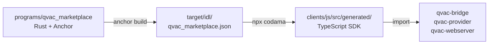

<h1 align="center">QVAC Marketplace — TypeScript Client</h1>

<p align="center">
  Auto-generated TypeScript SDK for the QVAC Marketplace Anchor program.<br/>
  Built with <a href="https://github.com/codama-idl/codama">Codama</a> from the program IDL, with <a href="https://github.com/anza-xyz/kit"><code>@solana/kit</code></a> v6 as the runtime.
</p>

<p align="center">
  
  
  
  
  
</p>

---

## ⚠️ Generated code — do not edit

Every file under `js/src/generated/` is rewritten from `target/idl/qvac_marketplace.json` whenever you run Codama. Manual edits will be overwritten. To change behavior, modify the Anchor program in [`programs/qvac_marketplace/`](../programs/README.md) and regenerate.

---

## 🔁 How it's generated



The Anchor build emits a canonical IDL. Codama reads it through `codama.json` (at the repo root) and produces typed instruction builders, account fetchers, PDA derivers, and error mappers. There is no manual translation step — the program is the source of truth.

---

## 📁 What's inside

```
clients/js/src/
└── generated/
    ├── index.ts              re-exports everything below
    ├── accounts/             provider, job — decoders + fetchers
    ├── instructions/         builders for all 7 program instructions
    ├── pdas/                 findProviderPda, findJobPda
    ├── programs/             program ID + discriminators
    ├── types/                JobState enum (encoder/decoder)
    └── errors/               typed MarketplaceError variants
```

| Module | Key exports | Purpose |
|---|---|---|
| **accounts** | `fetchMaybeProvider`, `fetchMaybeJob`, `getProviderDecoder`, `PROVIDER_DISCRIMINATOR` | Read on-chain accounts; decode raw bytes into typed structs |
| **instructions** | `getCreateJobInstructionAsync`, `getConsumerConfirmInstruction`, `getProviderCompleteInstructionAsync`, `getRegisterProviderInstructionAsync`, `getUpdateProviderInstructionAsync`, `getRotatePeerIdInstructionAsync`, `getRefundJobInstruction` | Build transactions for all 7 program instructions |
| **pdas** | `findProviderPda({ authority })`, `findJobPda({ consumer, nonce })` | Derive program-derived addresses |
| **programs** | `QVAC_MARKETPLACE_PROGRAM_ADDRESS` | Program ID constant |
| **types** | `JobState`, `getJobStateCodec` | `Pending`, `ProviderDone`, `Completed`, `Refunded`, `Disputed` |
| **errors** | `QVAC_MARKETPLACE_ERROR__*`, `isQvacMarketplaceError`, `getQvacMarketplaceErrorMessage` | Map on-chain error codes back to typed variants |

---

## 📦 Import pattern (important)

The generated client compiles as **CommonJS** under the root `tsconfig.json`. In ESM context (Node.js with `"type": "module"` and `NodeNext` resolution), `import * as`-namespace imports fail because all named exports land under `.default`. **Always use a default import** and destructure:

```js
import generatedClient from "../clients/js/src/generated/index.js"
const {
  findProviderPda,
  fetchMaybeProvider,
  getCreateJobInstructionAsync,
  JobState,
} = generatedClient
```

> 💡 The `.js` extension on the import path is correct even though the source is `.ts` — that's how `NodeNext` resolves ESM-style paths under TypeScript.

The runtime is `@solana/kit` ≥ 6.4 as a peer dependency:

```bash
npm install @solana/kit
```

The client isn't published to npm — consume it directly from this repo (`qvac-bridge/`, `qvac-provider/`, and `qvac-webserver/` all import via relative paths).

---

## 🧪 Common operations

### Fetch every registered provider

```js
import { createSolanaRpc } from "@solana/kit"
import generatedClient from "../clients/js/src/generated/index.js"
const { PROVIDER_DISCRIMINATOR, getProviderDecoder } = generatedClient

const rpc = createSolanaRpc("https://api.devnet.solana.com")
const decoder = getProviderDecoder()

const disc = Buffer.from(PROVIDER_DISCRIMINATOR).toString("base64")
const accounts = await rpc.getProgramAccounts(
  "6rbgdrQdxziVC25kt1Xmtz36ApiLdUVGpdyDcssmgoec",
  {
    encoding: "base64",
    filters: [{ memcmp: { offset: 0, bytes: disc, encoding: "base64" } }],
  },
).send()

for (const { pubkey, account } of accounts) {
  const bytes = new Uint8Array(Buffer.from(account.data[0], "base64"))
  const [p] = decoder.read(bytes, 0)
  console.log(p.name, "→", p.authority, `(${p.jobsCompleted} jobs)`)
}
```

### Derive a Provider PDA

```js
const [providerPda] = await findProviderPda({
  authority: "G2VLzNG1DipSkfaHEYn4y1Eh5x4MBYyqcEK9p1v9FXx2",
})
console.log(providerPda)  // → J6wtAsnmESxV...
```

### Fetch a single Job by PDA

```js
const { fetchMaybeJob, JobState } = generatedClient
const result = await fetchMaybeJob(rpc, jobPda)
if (!result.exists) {
  console.log("Job not found")
} else {
  console.log("state:", JobState[result.data.state])
  console.log("amount:", result.data.amount.toString(), "lamports")
}
```

### Build a `create_job` instruction

```js
const { getCreateJobInstructionAsync } = generatedClient

const ix = await getCreateJobInstructionAsync({
  provider: providerPda,
  consumer,                              // TransactionSigner
  requestHash,                           // SHA-256(payload || nonce_le8)
  nonce: 1n,
  amount: 10_000n,                       // lamports
  paymentMint: "So11111111111111111111111111111111111111112",
  quoteSignature,                        // 64-byte Ed25519 sig from provider
  taskType: 0,                           // TEXT
  validUntil: BigInt(Math.floor(Date.now() / 1000) + 300),
  quoteNonce,                            // 16-byte nonce from quote
})

// Append the Ed25519 precompile sibling instruction BEFORE this one.
// See qvac-bridge/solana.js → buildUnsignedTxBase64 for the full pattern.
```

<details>
<summary>📖 Why <code>getCreateJobInstructionAsync</code> and not <code>getCreateJobInstruction</code>?</summary>

The `Async` variants derive PDAs internally when seeds are passed instead of pre-derived addresses. They're slightly more convenient for one-off calls; the synchronous variants give you finer control when you already have the addresses. Either works.

</details>

For complete production code, see:

- [`qvac-bridge/solana.js`](../qvac-bridge/README.md) — consumer side (`createJob`, `confirmJob`, `refundJob`)
- [`qvac-provider/solana.js`](../qvac-provider/README.md) — provider side (`registerProvider`, `submitProviderComplete`)

---

## 🔧 Regenerating after program changes

If you modify anything under `programs/qvac_marketplace/src/`:

```bash
# 1. Rebuild — produces a fresh IDL at target/idl/qvac_marketplace.json
anchor build

# 2. Regenerate the client from the new IDL
npx codama
```

The second step rewrites every file under `clients/js/src/generated/`. Commit those alongside the program changes so consumers stay in lock-step with the on-chain layout.

If you've added a new instruction or account, the type system tells you exactly which downstream files need updating — TypeScript errors propagate from `clients/` into `qvac-bridge/`, `qvac-provider/`, and `qvac-webserver/` until you wire up the new entry point.

---

## 💡 Why generated, not hand-written?

Hand-written clients drift from the program. Codama reads the canonical IDL and produces:

- ✅ Typed builders with the same field names as the on-chain layout
- ✅ Account fetchers that respect the program's discriminator
- ✅ PDA derivers with seed bytes copied from the Rust source
- ✅ Enum encoders/decoders that match the Rust `repr`

When the program adds a field, you regenerate and TypeScript shows you every call site that needs an update. There is no path where the client encodes one shape and the program decodes another.

---

<p align="center">
  <a href="https://www.qvacmarketplace.io">qvacmarketplace.io</a>
  &nbsp;·&nbsp;
  <a href="https://github.com/qvacmarketplace/qvac-marketplace">GitHub</a>
  &nbsp;·&nbsp;
  <a href="../programs/README.md">Anchor program</a>
</p>
