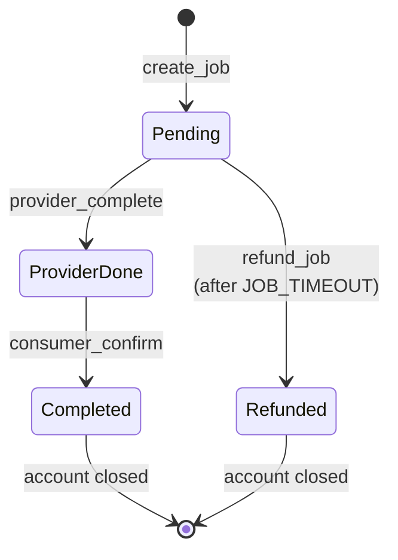
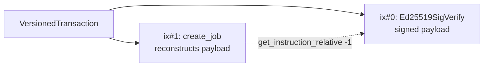

<h1 align="center">QVAC Marketplace — Anchor Program</h1>

<p align="center">
  The on-chain heart of the QVAC marketplace.<br/>
  A Solana smart contract in Rust + Anchor handling <b>provider registration</b>, <b>escrowed inference jobs</b>, and <b>trustless settlement</b>.
</p>

<p align="center">
  <a href="https://explorer.solana.com/address/6rbgdrQdxziVC25kt1Xmtz36ApiLdUVGpdyDcssmgoec?cluster=devnet">
    
  </a>
  
  
  
  
  
</p>

---

## 📜 Instructions

| # | Instruction | Caller | What it does |
|---|---|---|---|
| 1 | `register_provider`  | provider | Creates the Provider PDA — one per authority wallet |
| 2 | `update_provider`    | provider | Mutates `name` and `task_types` |
| 3 | `rotate_peer_id`     | provider | Replaces the on-chain DHT peer ID after a seed rotation |
| 4 | `create_job`         | consumer | Verifies the provider's signed quote, escrows SOL, opens a Job PDA |
| 5 | `provider_complete`  | provider | Commits the SHA-256 response hash; Job → `ProviderDone` |
| 6 | `consumer_confirm`   | consumer | Releases escrow to the provider; closes Job; rent → consumer |
| 7 | `refund_job`         | consumer | Reclaims escrow after `JOB_TIMEOUT` if the provider never delivered |

---

## 🔄 Job state machine



- **`Pending`** — funds in escrow; consumer can refund only here.
- **`ProviderDone`** — provider has committed a response hash. Refund is *blocked* (provider has delivered). Consumer can confirm anytime; after `CONFIRM_WINDOW` (300s) **anyone** may confirm to auto-release (prevents funds sitting forever if the consumer ghosts).
- **`Completed` / `Refunded`** — terminal states; the Job PDA is closed and rent returns to the consumer.
- **`Disputed`** — reserved for V2; not reachable in MVP.

---

## 🗄️ On-chain accounts

### Provider PDA

**Seeds:** `["provider", authority_pubkey]` — one per wallet.

| Field | Type | Notes |
|---|---|---|
| `version` | `u8` | Layout version (= `PROVIDER_VERSION = 1`) |
| `task_types` | `u16` | Bitmask — see [Task types](#-task-types) |
| `authority` | `Pubkey` | Owner; receives payouts |
| `qvac_peer_id` | `[u8; 32]` | Hyperdht public key — what consumers connect to |
| `name` | `String` | 3–50 UTF-8 bytes |
| `jobs_completed` | `u64` | Lifetime count |
| `jobs_disputed` | `u64` | Reserved (V2) |
| `total_earned` | `u64` | Lifetime lamports earned (`checked_add`) |
| `registered_at` | `i64` | Unix timestamp |
| `bump` | `u8` | Cached PDA bump |
| `reserved` | `[u8; 30]` | Forward-compat (stake, reputation, tier, etc.) |

### Job PDA

**Seeds:** `["job", consumer_pubkey, nonce_le8]` — supports multiple concurrent jobs per consumer.

| Field | Type | Notes |
|---|---|---|
| `version` | `u8` | Layout version (= `JOB_VERSION = 1`) |
| `task_type` | `u8` | Validated against `provider.task_types` |
| `consumer` | `Pubkey` | Funder + sole refund / rent destination |
| `provider` | `Pubkey` | Provider PDA snapshot |
| `provider_authority` | `Pubkey` | Payout target — snapshotted at create time |
| `request_hash` | `[u8; 32]` | `SHA256(payload ‖ nonce_le8)` |
| `response_hash` | `[u8; 32]` | Set by provider in `provider_complete` |
| `amount` | `u64` | Lamports escrowed (snapshot of agreed quote) |
| `payment_mint` | `Pubkey` | `Pubkey::default()` = native SOL (MVP) |
| `nonce` | `u64` | Consumer-supplied uniqueness seed |
| `created_at` | `i64` | Unix timestamp |
| `provider_done_at` | `i64` | Unix timestamp at `provider_complete` (0 until set) |
| `state` | `JobState` | See state machine above |
| `bump` | `u8` | Cached PDA bump |
| `reserved` | `[u8; 31]` | Forward-compat (token count, rating, response_ms, etc.) |

---

## ✍️ Quote signature design

The interesting bit. To bind off-chain pricing to on-chain settlement **without trusting the bridge**, the provider Ed25519-signs a price commitment that the consumer carries into `create_job`. The program verifies it via Solana's native `Ed25519SigVerify` precompile, sibling-instruction-style.

**Signed payload** (64 bytes):

```
| amount_le (8) | payment_mint (32) | valid_until_le (8) | quote_nonce (16) |
```

**Transaction layout** the consumer submits:



`create_job` reconstructs the exact 64 bytes from its own arguments, then asserts that the Ed25519 instruction at `index - 1`:

1. Targets the canonical `Ed25519SigVerify` program ID
2. References the same pubkey (`provider.authority`)
3. References the same signature (`quote_signature`)
4. References the same message (the reconstructed payload)

If anything mismatches → `InvalidQuoteSignature`. The bridge cannot forge prices, replay outdated quotes, or substitute a different provider. Every `create_job` is cryptographically pinned to a quote the provider chose to sign.

> 📖 **Scope of the quote binding.** The signed payload binds *price commitments* (`amount`, `payment_mint`, `valid_until`, `quote_nonce`) but **not** `request_hash`. Quotes are flat-rate commitments valid for any request hash until expiry. Providers should keep validity windows short (≤5 min, the SDK default) to limit exposure.

---

## ⚙️ Constants

| Name | Value | Where it bites |
|---|---|---|
| `JOB_TIMEOUT`     | `600` s     | `refund_job` becomes callable after `created_at + JOB_TIMEOUT` |
| `CONFIRM_WINDOW`  | `300` s     | After `provider_done_at + CONFIRM_WINDOW`, *anyone* can call `consumer_confirm` |
| `MIN_AMOUNT`      | `1,000` lamports | Minimum per-job escrow |
| `MIN_NAME_LEN`    | `3` bytes   | Provider name lower bound (UTF-8) |
| `MAX_NAME_LEN`    | `50` bytes  | Provider name upper bound (UTF-8) |

---

## 🏷️ Task types

`Provider.task_types` is a `u16` bitmask. Bit *N* set means task type *N* is supported.

| Bit | Discriminant | Task | Status |
|---:|---:|---|---|
| 0  | 0 | `Completion`       | ✅ MVP |
| 1  | 1 | `Embeddings`       | V2 |
| 2  | 2 | `Translation`      | V2 |
| 3  | 3 | `Transcription` (STT) | V2 |
| 4  | 4 | `TextToSpeech` (TTS) | V2 |
| 5  | 5 | `Ocr`              | V2 |
| 6  | 6 | `ImageGeneration`  | V2 |
| 7  | 7 | `Multimodal`       | V2 |
| 8  | 8 | `Rag`              | V2 |
| 9  | 9 | `VoiceAssistant`   | V2 |

Example: a provider supporting `Completion + Embeddings` sets `task_types = (1<<0) | (1<<1) = 3`.

---

## 🚨 Error codes

All errors start at the Anchor base (`6000`). 29 typed variants:

<details>
<summary><b>📋 Full error code reference</b></summary>

| Code | Name | Trigger |
|---|---|---|
| 6000 | `NameTooShort` | Provider name < 3 bytes |
| 6001 | `NameTooLong` | Provider name > 50 bytes |
| 6002 | `NoTaskTypesSpecified` | `task_types` bitmask is zero |
| 6003 | `UnauthorizedProvider` | Signer is not the registered authority |
| 6004 | `QuoteExpired` | `valid_until < now` |
| 6005 | `TaskTypeNotSupported` | Requested `task_type` bit not set on provider |
| 6006 | `InvalidTaskType` | `task_type > TaskType::MAX` |
| 6007 | `AmountBelowMinimum` | `amount < MIN_AMOUNT` |
| 6008 | `InvalidQuoteSignature` | Ed25519 sibling instruction does not match |
| 6009 | `QuoteSignatureMissing` | Ed25519 sibling instruction absent or malformed |
| 6010 | `QuotePayloadMalformed` | Reconstructed payload differs from signed bytes |
| 6011 | `PaymentMintMismatch` | `payment_mint` not native SOL (MVP) |
| 6012 | `JobNotPending` | `provider_complete` called on non-`Pending` job |
| 6013 | `ProviderMismatch` | Provider account does not match `job.provider` |
| 6014 | `ProviderAuthorityMismatch` | Signer is not `job.provider_authority` |
| 6015 | `InvalidResponseHash` | `response_hash` is all zeros |
| 6016 | `JobNotProviderDone` | `consumer_confirm` called before `provider_complete` |
| 6017 | `ConfirmWindowNotElapsed` | Non-consumer calling within `CONFIRM_WINDOW` |
| 6018 | `ProviderAuthorityAccountMismatch` | Account passed does not match `job.provider_authority` |
| 6019 | `ConsumerAccountMismatch` | Account passed does not match `job.consumer` |
| 6020 | `UnauthorizedRefund` | Signer is not `job.consumer` |
| 6021 | `RefundBlockedProviderDelivered` | Job state is `ProviderDone` |
| 6022 | `JobNotRefundable` | Job state is `Completed` / `Refunded` / `Disputed` |
| 6023 | `RefundTimeoutNotElapsed` | `now < created_at + JOB_TIMEOUT` |
| 6024 | `UnsupportedAccountVersion` | `version` byte does not match build's constant |
| 6025 | `ArithmeticOverflow` | `checked_add` / `checked_sub` overflow |
| 6026 | `InsufficientEscrow` | Job lamports balance below required amount |
| 6027 | `InvalidQvacPeerId` | `qvac_peer_id` is all zeros |
| 6028 | `InvalidRequestHash` | `request_hash` is all zeros |

</details>

The Codama-generated TypeScript client exposes typed variants as `QVAC_MARKETPLACE_ERROR__*` constants plus helpers `isQvacMarketplaceError()` and `getQvacMarketplaceErrorMessage()`. See [clients/README.md](../clients/README.md).

---

## 🛠️ Build, test, deploy

```bash
# Build — writes IDL → target/idl/qvac_marketplace.json
anchor build

# Run the 39-test suite against a local validator
anchor test

# Deploy to devnet (upgrade authority must be funded)
anchor deploy --provider.cluster devnet
```

> ⚠️ **Back up the program keypair.** It lives at `target/deploy/qvac_marketplace-keypair.json`. Losing it means you cannot upgrade the program; you'd have to redeploy at a new address and migrate the entire ecosystem (provider registrations, in-flight jobs, the bridge config, the frontend, the explorer link).

---

## 🛡️ Security posture

<details>
<summary><b>🔐 Defensive properties enforced by the program</b></summary>

- **Checked arithmetic.** All counter updates use `checked_add` / `checked_sub`. Overflow → tx fails with `ArithmeticOverflow`.
- **Explicit account constraints.** Every account is bound by either PDA re-derivation, `has_one`, or an explicit `address` constraint. No discriminator-only checks.
- **Version gates.** `Provider.version` and `Job.version` are validated on every read; future-incompatible builds reject old data with `UnsupportedAccountVersion`.
- **No `unwrap` / `expect`.** Errors propagate via `Result<>`. Instruction handlers return typed `MarketplaceError` codes.
- **Sibling-only Ed25519.** Quote signature verification requires the precompile reference indices to be `u16::MAX` (self-instruction). Cross-instruction lookup is rejected to prevent payload smuggling.
- **Authority snapshot.** `job.provider_authority` is snapshotted at `create_job`. Even if the provider rotates their on-chain record mid-flight, payment still goes to the originally agreed authority.
- **Refund path is one-way.** Once `provider_complete` lands, refunds are permanently blocked. The consumer's recourse moves to the confirmation step (and in V2, the dispute flow).

</details>

<details>
<summary><b>⚠️ Known MVP limitations</b></summary>

- **No content verification.** A bad provider can submit any 32-byte `response_hash` and still earn the fee — the program enforces that *something* was committed, not that it matches the actual response. The consumer's MVP recourse is to not select that provider again (reputation lives on-chain via `jobs_completed` and `jobs_disputed`).
- **Quote replay window.** Within `valid_until`, a quote signature can be reused for multiple jobs at the same price. Providers should keep windows short (≤5 min default in the SDK).
- **No consumer binding.** Quotes are flat-rate; signed payload omits the consumer pubkey. Pricing tiers per consumer require a V2 program upgrade.
- **No SPL payment.** `payment_mint` is reserved but only native SOL is honored in MVP.

V2 plans: dispute flow with on-chain arbitration, SPL payment routes, provider staking, consumer-bound quotes.

</details>

---

## 🔁 Generated TypeScript client

The IDL emitted by `anchor build` feeds Codama, which produces a typed TypeScript SDK under [`clients/js/src/generated/`](../clients/README.md). When you change the program, regenerate immediately so off-chain code stays in lock-step with the on-chain layout.

---

<p align="center">
  <a href="https://www.qvacmarketplace.io">qvacmarketplace.io</a>
  &nbsp;·&nbsp;
  <a href="https://github.com/qvacmarketplace/qvac-marketplace">GitHub</a>
  &nbsp;·&nbsp;
  <a href="../clients/README.md">TypeScript client</a>
  &nbsp;·&nbsp;
  <a href="../qvac-bridge/README.md">Bridge</a>
  &nbsp;·&nbsp;
  <a href="../qvac-provider/README.md">Provider</a>
</p>
