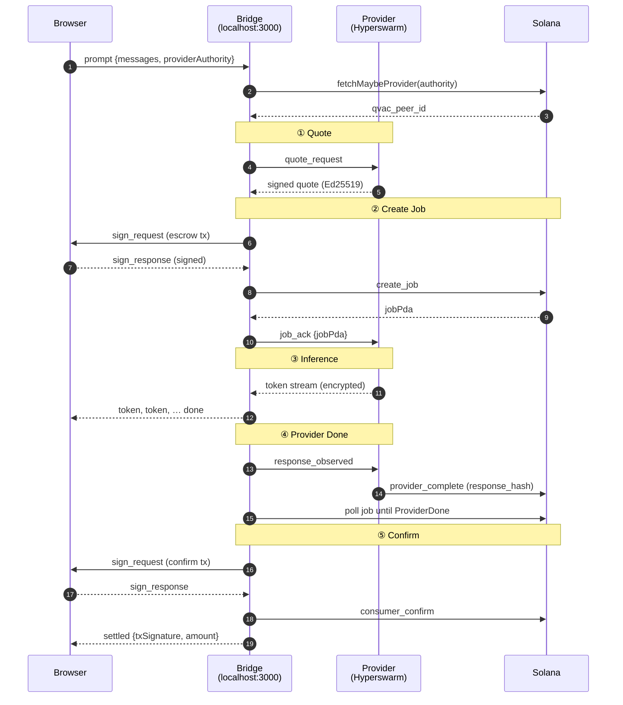

<h1 align="center">QVAC Bridge</h1>

<p align="center">
  Local WebSocket bridge that connects your browser to the QVAC P2P network.<br/>
  The browser can't speak Holepunch DHT or hold private keys — the bridge does both safely, on your machine.
</p>

<p align="center">
  
  
  
  
  
</p>

---

## 🤔 What is the bridge?

Think of it as **MetaMask for inference jobs** — a small local daemon that extends what your browser can safely do:

| Browser cannot | The bridge can |
|---|---|
| Open Hyperswarm/DHT sockets | ✅ Maintains a long-lived DHT connection |
| Build and submit Solana transactions reliably | ✅ Uses `@solana/kit` with full retry/confirm logic |
| Hold private keypair files | ✅ (Optional) Reads a local keypair for demo mode |
| Run independently of an open tab | ✅ Stays alive between page reloads |

The bridge listens on `127.0.0.1:3000` only. The marketplace UI in your browser opens a WebSocket to it; the bridge does the rest.

---

## 🚀 Quick start

```bash
git clone https://github.com/qvacmarketplace/qvac-marketplace
cd qvac-marketplace/qvac-bridge
npm install
cp .env.example .env          # edit if you want demo mode (see below)
npm start
```

Then open [www.qvacmarketplace.io](https://www.qvacmarketplace.io) — the bridge pill in the top-right turns green within a second.

> 💡 **Mac / npm users:** if you see an `ERESOLVE` peer-dependency error on install, run:
> ```bash
> npm install --legacy-peer-deps
> ```
> This is a known conflict between `bare-fetch` versions inside `@qvac/sdk` and is safe to bypass.

---

## 📋 Requirements

- **Node.js ≥ 22.17** — the QVAC SDK fails silently on older versions. Check with `node --version`.
- **A Solana devnet wallet with SOL.** Two ways to provide it:
  - **Phantom** *(recommended)* — sign in-browser, key stays in the extension.
  - **Demo mode** — bridge auto-signs using a local `.json` keypair. Useful for testing and demos. **There is a 0.1 SOL per-job cap in demo mode** to limit blast radius if a malicious provider quotes wildly.

---

## ⚙️ Configuration

```env
# .env
SOLANA_RPC=https://api.devnet.solana.com

# Demo mode only — leave commented out if you'll use Phantom
# SOLANA_KEYPAIR_PATH=/home/you/.config/solana/consumer.json
```

| Variable | Required | Purpose |
|---|---|---|
| `SOLANA_RPC` | No | RPC endpoint (default `http://localhost:8899`) |
| `SOLANA_KEYPAIR_PATH` | No | If set → demo mode auto-signing; if unset → Phantom-only |
| `SOLANA_WS_URL` | No | Override the auto-derived `wss://` URL for subscriptions |

For demo mode, generate and fund the keypair:

```bash
solana-keygen new -o ~/.config/solana/consumer.json
solana airdrop 2 ~/.config/solana/consumer.json --url devnet
```

---

## 🔄 Full job lifecycle

Every inference request from the browser triggers this five-phase choreography:



In demo mode, the two `sign_request`/`sign_response` round-trips are replaced by the bridge signing transactions directly with the local keypair — no Phantom popups.

---

## 💬 WebSocket message protocol

The browser connects to `ws://127.0.0.1:3000`. All messages are JSON with a `type` field.

### 📤 Browser → Bridge

| `type` | Payload | When |
|---|---|---|
| `prompt`        | `{ messages, providerAuthority, providerPublicKey?, options? }` | Start a new inference job |
| `sign_response` | `{ txId, signedTxBase64 }`                                     | Returns a Phantom-signed tx requested via `sign_request` |
| `sign_rejected` | `{ txId }`                                                     | User cancelled the Phantom popup |
| `refund`        | `{ jobPda }`                                                   | Reclaim escrow (only after `JOB_TIMEOUT` and only if `Pending`) |
| `disconnect`    | `{}`                                                           | Close the active P2P connection |
| `check_status`  | `{ authorities: [pubkey, …] }`                                 | DHT-ping each provider for online status |

### 📥 Bridge → Browser

| `type` | Payload | When |
|---|---|---|
| `connected`             | `{ providerAuthority }`              | P2P channel to provider established |
| `status`                | `{ stage, text }`                    | Progress updates — stages: `quote`, `signing`, `job`, `connecting`, `generating`, `settling` |
| `token`                 | `{ token }`                          | One streamed inference token |
| `done`                  | `{ stats }`                          | End of token stream (before settlement) |
| `sign_request`          | `{ txId, txBase64, description }`    | Ask the browser to sign a transaction in Phantom |
| `settled`               | `{ txSignature, amount }`            | Job confirmed — SOL released to provider |
| `refunded`              | `{ txSignature, jobPda }`            | Refund transaction landed |
| `provider_disconnected` | `{}`                                 | P2P socket closed (provider went offline or `disconnect` was sent) |
| `status_results`        | `{ results: [{ authority, online, latency? }, …] }` | Reply to `check_status` |
| `error`                 | `{ message }`                        | Anything went wrong; user-facing error string |

---

## 🔐 Phantom vs demo mode

<details>
<summary><b>👻 Phantom mode (recommended)</b></summary>

The bridge builds the transaction (escrow at phase ②, release at phase ⑤), sends the raw bytes to the browser via `sign_request`, the browser shows Phantom's approval popup, Phantom signs, the browser returns the signed bytes via `sign_response`, the bridge submits.

**Your private key never enters the bridge process.** The bridge only ever sees a fully-formed signed transaction it can broadcast — it cannot create unauthorized transactions with your key.

Two popups per inference:
1. **Escrow** — "Escrow 0.000010 SOL" — locks SOL in a Job PDA on Solana
2. **Release** — "Release 0.000010 SOL" — pays the provider and closes the Job PDA

Both are the same SOL moving in two steps, not two separate charges. Total per request = quoted price + two small network fees.

</details>

<details>
<summary><b>🤖 Demo mode (local automation)</b></summary>

If `SOLANA_KEYPAIR_PATH` is set in `.env`, the bridge auto-signs both transactions using that keypair. No Phantom popup. Useful for testing, demos, and headless automation.

Guardrails:
- **Per-job 0.1 SOL cap.** A malicious provider quoting an inflated price gets `quote_rejected` instead of draining your wallet.
- **Keypair file on disk.** Protect it with file permissions and keep it out of version control.

Phantom mode is recommended for everything except local automation.

</details>

---

## 🛡️ Security

- **Bind address.** Listens on `127.0.0.1:3000` only — unreachable from your LAN, your Wi-Fi, or the internet.
- **Origin allow-list.** WebSocket connections rejected unless `Origin` is `qvacmarketplace.io` (production) or `localhost:3001` (dev). Other websites cannot CSRF the bridge.
- **Phantom-mode key separation.** The browser holds the key, the bridge holds the network. Neither alone can spend funds.
- **Demo-mode amount cap.** 0.1 SOL ceiling on auto-signed quotes (`MAX_DEMO_AMOUNT_LAMPORTS = 100_000_000`).
- **Buffer caps.** Hyperswarm sockets reject any single line over 64 KB — prevents memory exhaustion DoS.
- **Crypto-random IDs.** Session, transaction, and quote IDs are generated with `crypto.randomBytes`, not `Math.random()`.
- **Rate limiting** *(on the provider side)*: quote channel caps 10 requests / 10 seconds per peer; over-limit → `quote_rejected`.
- **Error scrubbing.** User-facing error messages are scrubbed before being sent to the browser — filesystem paths never leak.

---

## 🖥️ Operations

The bridge logs each session and key transaction to stdout, prefixed with the 8-char session ID:

```
[F1084ED9] browser connected
[F1084ED9] qvacPeerId: a1b2c3d4e5f6789a…
[F1084ED9] quote: 10000 lamports, valid until 1747000600
[F1084ED9] job acked: J6wtAsnmESxV…
[F1084ED9] response complete
[F1084ED9] settled: 121uEmSfaqDTqiK6…
```

For long-running deployments, use a process manager:

```bash
npm install -g pm2
pm2 start "npm start" --name qvac-bridge
pm2 save
pm2 startup
```

---

## 🩺 Troubleshooting

<details>
<summary><b>"Bridge not detected" (red pill in the UI)</b></summary>

- Confirm `npm start` is running in this directory.
- Check for `EADDRINUSE` in the terminal — port 3000 may be taken by another process.
- Verify `node --version` is ≥ 22.17.
- Browser opened from an HTTPS site? Then it can only connect via WSS, which the local bridge doesn't speak. Use the hosted site `qvacmarketplace.io` (which proxies correctly) or `localhost:3001` if running the webserver locally.

</details>

<details>
<summary><b>"Connection rejected — origin not allowed"</b></summary>

You loaded the marketplace UI from a non-allowlisted origin. Use the hosted site (`qvacmarketplace.io`) or the local dev server (`localhost:3001`).

</details>

<details>
<summary><b>"Quote channel connect timeout"</b></summary>

The provider's DHT announcement can take up to 15 seconds to propagate on devnet. Wait until the *provider's* terminal prints `Quote channel: open`, then retry.

</details>

<details>
<summary><b>"Provider quoted N lamports — exceeds demo-mode cap"</b></summary>

The provider asked for more than 0.1 SOL and you're in demo mode. Switch to Phantom (per-tx approval) or pick a different provider.

</details>

<details>
<summary><b>"Transaction rejected in Phantom"</b></summary>

You hit Cancel in the Phantom popup. Send the message again.

</details>

<details>
<summary><b>Phantom shows the wrong network</b></summary>

Open Phantom → Settings → Developer Settings → enable Testnet Mode and select Devnet.

</details>

<details>
<summary><b>"Insufficient lamports" mid-job</b></summary>

Top up your devnet balance. Click **Airdrop 1 SOL** in the marketplace UI (Phantom mode) or run `solana airdrop 2 <keypair> --url devnet` (demo mode).

</details>

---

## 🛣️ Roadmap

- **One-click installer** — a packaged binary (via `pkg` or similar) so consumers don't need to install Node.js or run `npm` themselves. Click → run → marketplace pill goes green.
- **Native desktop app** — Electron or Tauri wrapper for status tray icon, system notifications, and auto-start.
- **Mobile support** — currently impossible because mobile browsers can't reach a local WebSocket. A native mobile app with embedded P2P would solve this.

---

<p align="center">
  <a href="https://www.qvacmarketplace.io">qvacmarketplace.io</a>
  &nbsp;·&nbsp;
  <a href="https://github.com/qvacmarketplace/qvac-marketplace">GitHub</a>
  &nbsp;·&nbsp;
  <a href="../qvac-provider/README.md">Provider</a>
  &nbsp;·&nbsp;
  <a href="../programs/README.md">Anchor program</a>
  &nbsp;·&nbsp;
  <a href="../clients/README.md">TypeScript client</a>
</p>
