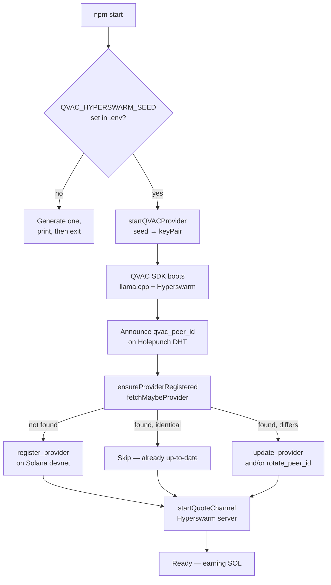
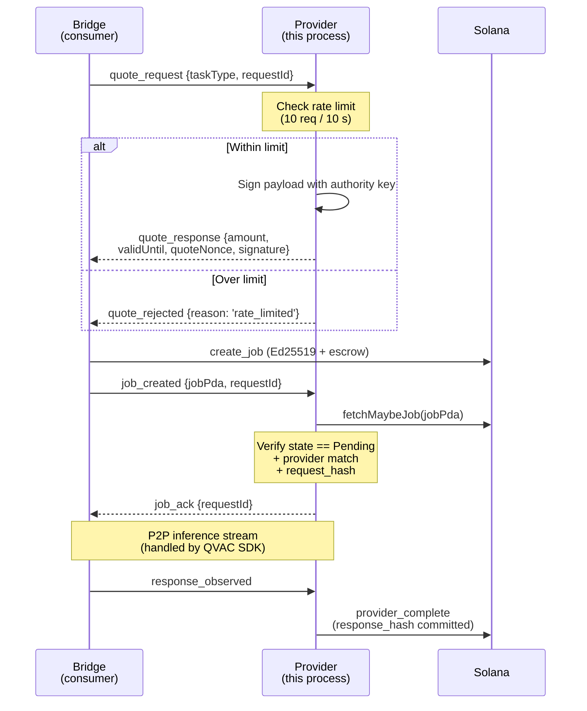

<h1 align="center">QVAC Provider</h1>

<p align="center">
  Run an AI inference node on the QVAC marketplace and earn SOL on Solana devnet.<br/>
  When a consumer submits a job, your node receives the request over an encrypted P2P channel, runs inference locally, and is paid automatically when the consumer confirms the result.
</p>

<p align="center">
  
  
  
  
  
  
</p>

---

## 🤔 What is the provider?

A long-running Node.js process that does three things in parallel:

1. **Hosts an LLM locally** via the QVAC SDK (`@qvac/sdk` → `llama.cpp` backend).
2. **Announces itself on Holepunch DHT** so consumers can find and stream to it without port-forwarding.
3. **Stays in sync with Solana** — registers a Provider PDA, signs Ed25519 price quotes, commits response hashes on completion.

You provide the hardware and the model weights; the marketplace handles discovery, payment, and settlement.

---

## 🚀 Quick start

```bash
git clone https://github.com/qvacmarketplace/qvac-marketplace
cd qvac-marketplace/qvac-provider
npm install

# Generate a keypair, fund it on devnet, generate a stable DHT seed
solana-keygen new -o ~/.config/solana/provider.json
solana airdrop 2 ~/.config/solana/provider.json --url devnet
node -e "console.log(require('crypto').randomBytes(32).toString('hex'))"

# Configure (see Setup below), then:
npm start
```

Within ~30 seconds your node appears at [www.qvacmarketplace.io](https://www.qvacmarketplace.io). When a consumer picks you and sends a prompt, you earn SOL automatically.

---

## 📋 Requirements

| Item | Notes |
|---|---|
| **Node.js ≥ 22.17** | QVAC SDK fails silently on older versions |
| **Solana devnet wallet** | Fund with at least **0.1 SOL** for registration + tx fees |
| **RAM** | ~1–2 GB for Qwen3-600M default; ~6–8 GB for larger models |
| **Disk** | ~500 MB for the default model weights |
| **Network** | Reachable from the public internet (Hyperswarm NAT-punches; no port forwarding needed) |
| **OS** | Linux / WSL / macOS / Windows. Tested on WSL2 Ubuntu 24.04 |

A GPU helps throughput but isn't required — quantized models run on CPU.

### 🐧 Linux system libraries

On Ubuntu/Debian servers (AWS, Lightsail, DigitalOcean), install these before `npm install`. See the [official QVAC SDK install guide](https://docs.qvac.tether.io/sdk/getting-started/installation/) for full platform requirements.

```bash
sudo apt-get install -y libatomic1 libvulkan1 g++-13
```

| Package | Required by | Missing → |
|---|---|---|
| `libatomic1` | `rocksdb-native` (via corestore) | `Cannot open shared object file: libatomic.so.1` |
| `libvulkan1` | `@qvac/llm-llamacpp` inference backend | `Cannot open shared object file: libvulkan.so.1` |
| `g++-13` | Native addon compilation | Build errors during `npm install` |

> 💡 Without a GPU, the Vulkan loader still satisfies the linker — inference automatically falls back to CPU.

---

## ⚙️ Setup

### 1. Install

```bash
git clone https://github.com/qvacmarketplace/qvac-marketplace
cd qvac-marketplace/qvac-provider
npm install
```

### 2. Create and fund a provider wallet

```bash
solana-keygen new -o ~/.config/solana/provider.json

# Airdrop is rate-limited; rerun if it fails
solana airdrop 2 ~/.config/solana/provider.json --url devnet
solana balance ~/.config/solana/provider.json --url devnet
```

### 3. Generate a stable DHT identity

The Hyperswarm seed determines your P2P identity. **Generate it once and keep it constant** — every change submits a `rotate_peer_id` transaction on-chain (which costs a small fee and briefly orphans existing consumer connections).

```bash
node -e "console.log(require('crypto').randomBytes(32).toString('hex'))"
# → Copy this 64-character hex string into .env below
```

### 4. Configure `.env`

```bash
cp .env.example .env
```

```env
SOLANA_RPC=https://api.devnet.solana.com
SOLANA_KEYPAIR_PATH=/home/you/.config/solana/provider.json

# 32-byte hex DHT seed — generate ONCE and keep stable
QVAC_HYPERSWARM_SEED=<paste your hex string from step 3>

# Display name shown in the marketplace UI (overrides qvac.config.json)
PROVIDER_NAME=My AI Node
```

Pricing and supported task types live in [`qvac.config.json`](#-service-configuration-qvacconfigjson).

### 5. Start

```bash
npm start
```

**First run** registers the provider on-chain:

```
Starting QVAC provider...
QVAC peer ID: a1b2c3d4...
Registering provider on-chain...
Provider registered.
Authority:    G2VLzNG1...
Provider PDA: J6wtAsnm...
Quote channel: open

Running... Press Ctrl+C to stop
```

**Subsequent runs** reuse the existing record (and submit `update_provider` or `rotate_peer_id` only if `name`, `taskTypes`, or DHT seed changed):

```
Starting QVAC provider...
QVAC peer ID: a1b2c3d4...
Provider already up-to-date.
Quote channel: open
```

Your node appears in the marketplace within ~30 seconds.

---

## 🔄 Startup sequence



The whole boot takes ~5–15 seconds depending on devnet RPC latency.

---

## 💬 Quote channel protocol

Consumers reach you through a Hyperswarm server you announce on the DHT. Each connection negotiates one job through this message flow:



| Message | Direction | Purpose |
|---|---|---|
| `quote_request`   | Bridge → Provider | Ask for price quote for a task type |
| `quote_response`  | Provider → Bridge | Ed25519-signed price commitment |
| `quote_rejected`  | Provider → Bridge | Rate limit hit or task type not supported |
| `job_created`     | Bridge → Provider | Notify provider that on-chain `create_job` landed |
| `job_ack`         | Provider → Bridge | Provider verified job on-chain, ready to serve |
| `response_observed` | Bridge → Provider | Browser saw the full response; submit `provider_complete` |

---

## 💰 How earnings work

```
1. Consumer asks your quote channel: "what's the price for task type X?"
2. You sign a quote payload with your authority key and return it.
3. Consumer creates a Job on Solana, escrowing the quoted SOL.
4. You verify the on-chain Job (state, provider match, request hash).
5. You stream inference tokens P2P (handled by the QVAC SDK).
6. After completion, you submit `provider_complete` with a SHA-256 of the output.
7. Consumer signs `consumer_confirm` — escrow lands directly in your wallet.
```

All of this is automatic. You just keep the process running.

You can watch accumulated earnings on-chain — `Provider.total_earned` increments after every confirmed job. The marketplace UI also shows total SOL earned and jobs completed per provider.

---

## 🔧 Configuration reference

### Environment variables (`.env`)

| Variable | Required | Purpose |
|---|---|---|
| `SOLANA_RPC` | No | RPC endpoint (default `http://localhost:8899`) |
| `SOLANA_KEYPAIR_PATH` | No | Provider keypair JSON (default `~/.config/solana/id.json`) |
| `QVAC_HYPERSWARM_SEED` | **Yes** | 32-byte hex DHT seed — generate once and keep stable |
| `PROVIDER_NAME` | No | Display name in the UI (overrides `qvac.config.json`) |

### Service configuration (`qvac.config.json`)

```json
{
  "serve": {
    "models": {
      "my-llm": {
        "model": "QWEN3_4B_INST_Q4",
        "default": true,
        "preload": true,
        "config": { "ctx_size": 4096 }
      }
    }
  },
  "marketplace": {
    "name": "my-provider",
    "taskTypes": 1,
    "pricePerRequest": 10000
  }
}
```

| Section | Key | Description |
|---|---|---|
| `serve.models` | `<alias>.model` | QVAC SDK model identifier — e.g. `QWEN3_4B_INST_Q4`, `LLAMA3_8B_INST_Q4` |
|                | `<alias>.default` | `true` if this is the alias served when no specific model is requested |
|                | `<alias>.preload` | Load weights at startup (avoid first-request stall) |
|                | `<alias>.config.ctx_size` | Context window size in tokens |
| `marketplace`  | `name` | Display name (overridden by `PROVIDER_NAME` env) |
|                | `taskTypes` | u16 bitmask — see [Task type bitmask](#-task-type-bitmask) |
|                | `pricePerRequest` | Price in **lamports** (1 SOL = 1,000,000,000 lamports) |

### 🏷️ Task type bitmask

`taskTypes` is a `u16` bitmask. Bit *N* set means task type *N* is supported.

| Bit | Task | Status |
|---:|---|---|
| 0 | `TEXT`  | ✅ MVP |
| 1 | `EMBED` | V2 |
| 2 | `TRANS` | V2 |
| 3 | `STT`   | V2 |
| 4 | `TTS`   | V2 |
| 5 | `OCR`   | V2 |
| 6 | `IMG`   | V2 |
| 7 | `MULTI` | V2 |
| 8 | `RAG`   | V2 |
| 9 | `VOICE` | V2 |

For TEXT only, set `taskTypes: 1`. For TEXT + EMBED, set `taskTypes: 3` (binary `11`).

---

## 💲 Pricing strategy

Quote-channel rate limit defaults to **10 quote requests per 10 seconds per peer** (Ed25519 signing is cheap but spammable). For a hackathon-grade node, the default `pricePerRequest: 10000` (0.00001 SOL) is fine. For real operation:

- **Cover your costs.** Each completed job costs you one Solana tx fee (~5,000 lamports for `provider_complete`). Set `pricePerRequest` well above this floor.
- **Reflect compute.** A 7B-parameter model on CPU costs orders of magnitude more wall-clock than a 600M model on GPU. Don't price them the same.
- **Iterate.** You can change `pricePerRequest` any time — restart the node and the new price applies to subsequent quotes.

---

## ♾️ Keeping it running

For a persistent node, use a process manager:

```bash
sudo npm install -g pm2
sudo pm2 start "npm start" --name qvac-provider --cwd /path/to/qvac-marketplace/qvac-provider
sudo pm2 save
sudo pm2 startup
```

Or write a small systemd unit if you prefer. The provider is a long-lived stateless process — restart-safe as long as the DHT seed and keypair stay constant.

Logs go to stdout. With pm2: `pm2 logs qvac-provider`.

---

## 🩺 Troubleshooting

<details>
<summary><b>"Cannot open shared object file: libatomic.so.1" / "libvulkan.so.1"</b></summary>

Install the Linux system libraries:
```bash
sudo apt-get install -y libatomic1 libvulkan1 g++-13
```

</details>

<details>
<summary><b>Registration fails with "insufficient funds"</b></summary>

Airdrop more SOL:
```bash
solana airdrop 2 ~/.config/solana/provider.json --url devnet
```
The faucet is rate-limited — rerun a few times if needed.

</details>

<details>
<summary><b>Consumer sees "Quote channel connect timeout"</b></summary>

Your DHT announcement can take up to 15 seconds to propagate. Wait for `Quote channel: open` in your terminal before the consumer connects.

</details>

<details>
<summary><b>Node appears offline in the marketplace after restart</b></summary>

Make sure `QVAC_HYPERSWARM_SEED` in `.env` matches what was used at registration. A different seed triggers `rotate_peer_id` on-chain; the marketplace's DHT ping picks up the new key within 30 seconds. If you intentionally rotated, just wait.

</details>

<details>
<summary><b>"Provider PDA already exists" on first run</b></summary>

You already registered with this keypair previously. Normal — the node will only update the fields that changed (name, peer ID).

</details>

<details>
<summary><b>Consumer sees `quote_rejected` with reason `rate_limited`</b></summary>

The bridge sent more than 10 quote requests in a 10-second window. This is the per-socket DoS guard. Normal reachable usage doesn't trigger it — instruct the consumer to wait briefly and retry.

</details>

<details>
<summary><b>Inference is too slow</b></summary>

The default model is Qwen3-600M, which fits in ~1 GB RAM and runs on CPU. For higher throughput, switch to a smaller quant or run on hardware with more compute. Model selection is wired in `provider.js` → see the QVAC SDK docs for the model-loading API.

</details>

<details>
<summary><b>"PEER_NOT_FOUND" when consumer connects</b></summary>

The DHT entry for your `qvac_peer_id` hasn't propagated yet, or it's been evicted. Check that `Quote channel: open` is still in your logs. If the process restarted, wait ~30 seconds for re-announcement.

</details>

<details>
<summary><b>Lock file errors / corestore conflicts</b></summary>

You probably have two `qvac-provider` instances pointing at the same data directory. Stop the duplicate (`pm2 list`, `pkill node`, etc.), then restart.

</details>

---

## 🛣️ Roadmap

- **One-click provider installer** — packaged binary that bundles Node.js, the SDK, and the model weights. Click → run → earning.
- **Multi-model serving** — load multiple model aliases at once and route by `taskType`.
- **GPU autodetect** — automatically pick the best inference backend (CUDA / Metal / Vulkan / CPU) without manual config.
- **Provider staking** — stake SOL against your registration to signal reliability. V2 program change.
- **Reputation scoring** — on-chain `total_earned` / `jobs_completed` plus consumer ratings (V2).

---

<p align="center">
  <a href="https://www.qvacmarketplace.io">qvacmarketplace.io</a>
  &nbsp;·&nbsp;
  <a href="https://github.com/qvacmarketplace/qvac-marketplace">GitHub</a>
  &nbsp;·&nbsp;
  <a href="../qvac-bridge/README.md">Bridge</a>
  &nbsp;·&nbsp;
  <a href="../programs/README.md">Anchor program</a>
  &nbsp;·&nbsp;
  <a href="../clients/README.md">TypeScript client</a>
</p>
